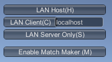
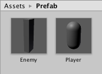
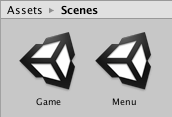
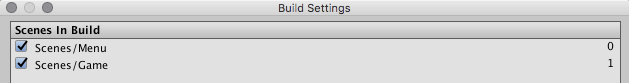
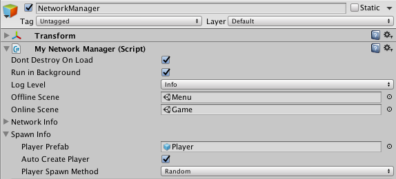
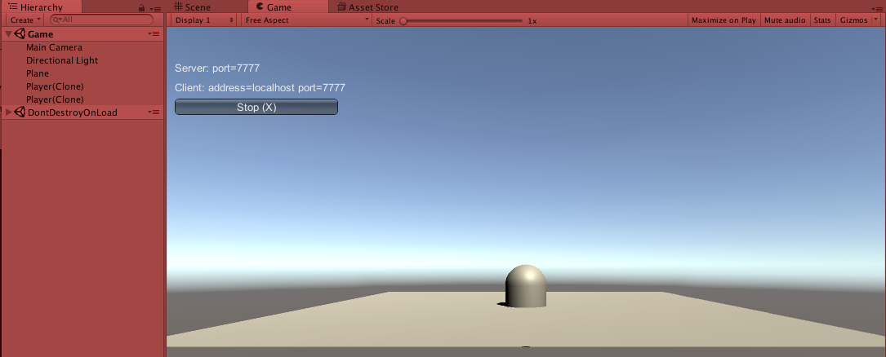
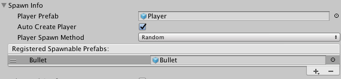
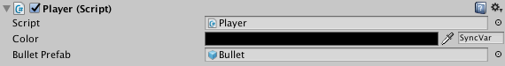
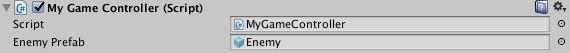
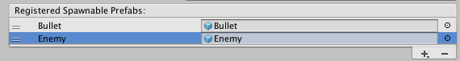

# Networking Information
There is a lot to networking games. A good starting point is from _Gaffer On Games_ "[What every programmer needs to know about game networking](http://gafferongames.com/networking-for-game-programmers/what-every-programmer-needs-to-know-about-game-networking/)". Every engine does things a little bit differently, but knowing what goes into making this work properly is good to know.

It is really important that you look through the [Unity Networking Overview](http://docs.unity3d.com/Manual/UNetOverview.html). We will be leaning towards the High Level APIs for class, which this doc will summarize

## Ports, Sockets, IPs...
* *IP* - Address of a specific machine or device. There are 2 forms of IP addresses [IPv4](https://en.wikipedia.org/wiki/IPv4) and [IPv6](https://en.wikipedia.org/wiki/IPv6), most common is IPv4 (ie: 127.0.0.1) which can have about 17 million unique addresses. IPv6 is can have about 4.3 billion addresses, and is intended to replace it (at some point) 
* *Sockets* - Represent a connection between two applications, which is bi-directional. It had two types of transportation modes, TCP and UDP. 
* *Ports* - Are like an address which ranges from 0 - 65535. Port numbers under 1024 are assigned to "well-known" applications to avoid getting used for uncommon services. Port 80, is reserved for HTTP.

A good analogy of the three is a IP is like an apartment building, a port is like a door number, and the socket is the door. 

Luckily, you don't really have to worry about the inner workings of TCP/IP.

## Servers and Hosts
In networking games, there are different types of server. 

_Peer-to-peer_ was a common thing, in the early ages of gaming. It's a fairly simple model to follow, and it lends itself well to RTS game where things happen in a fairly consistent, logical order. However, trying to play an action game in this way not not practical. 

With the advent of Quake, the _client/server_ model became popular. Each player in the game world is considered a _client_, while there was one computer deemed the _server_ . The server would be the one handle the load of calculating everything, and the clients would supply the input, and render their player's world. 

 image from Unity Docs

A _dedicated server_ is something that does all the simulation of the game world, but no one plays the game on that instance. If there is no dedicated server, one client will also work as a server. In either case, which ever system that is running as the server will be considered the _host_. Dedicated servers are not too common with Unity, however, it is possible to set one up if you start Unity from command line with the options `-batchmode -nographics` on a Windows machine (a Pro license of Unity might still be required).

## Unity Multiplayer Service
There is a service with Unity called [Multiplayer](https://unity3d.com/services/multiplayer) which is basically having Unity host your game as a dedicated server for you in the cloud. In that instance, you get charged based on how much data is sent to and from your game (which is another reason you want to optimize your data your game passes around). For this class we will not be going to be using it.

## Unity Legacy Network
I'm sure you will go through Unity tutorials and come across things that still work in Unity, but is has been marked as legacy. Unity had something called the Master Server. It is a special server that handles finding Unity games of a `GameType`. With the legacy network, you would have to initialize the server. GameObjects would need to have  , connect to it. Calls would have to 

# Unity UNet
With Unity 5.1, they introduced UNet which tries to simplify some of the networking work. 

## High Level API and NetworkTransport API
**High Level API** (referred to as HLAPI) is for those making multiplayer games, which is what we will be focusing on. This contains all the necessary commands to help you produce a networked-multiplayer game.

Once you get comfortable and need to start messing with the inners of the networking infrastructure, the **NetworkTransport API** will let you get into that. Here, you can get more into the details of networking and optimize it for your game. In this class we will not be covering the NetworkTransport API.

# Unity Network System Concepts

## Instantiate and Spawn
Normally, you *instantiate* a new object, however when networking, you will need to be "spawned" by the server. More on that later

## Players, Local Players and Authority
In networking games, there are player objects associated with each person. A person cannot invoke commands on other players' object. So there is a concept known as "my" player. `isLocalPlayer` is a flag, set to true, for when a player object is on that client. You have to used this `isLocalPlayer` flag to prevent user input or camera movement.

 image from Unity Docs

For non-player objects, like enemies, there is no client they live on the server.

 image from Unity Docs

There are a few properties that are useful to determine who has control of what:

* `isServer` - True if object is on a server
* `isClient` - True if on a client that was created by the server
* `isLocalPlayer` - True if the object is also the player object on this client
* `hasAuthority` - True of the object is owned by this local client or server

## NetworkManager
Is a class designed to help create your network and mange your multiplayer game. You do not need to script anything, but for more "professional" results, you will want to implement the HUD yourself (eventually).

### Player and Spawning Management
Instantiating is different for multiplayer games, being the the server should be the one who has control over spawning and it will need to know what these prefabs should be. For this, the Player This includes, enemies, projectiles, pickups, etc.

*NOTE:* All prefabs to be used with the Player or Spawning Management _must_ have a NetworkIdentity on their root object!

### Scene Management
You need to select 2 scenes:

  * Offline - This will be your lobby/conclusion scenes
  * Online - The game level that is used.

*NOTE:* In order to add the scenes to the Scene Management, you _must_ have them set up in the project's Build settings.

### [NetworkManagerHUD](http://docs.unity3d.com/Manual/UNetManager.html)



### Testing...
You need to open another copy of Unity to test (otherwise you need to build your project every time!). On Windows, this can be done by just launching another Unity instance and opening the project from the project wizard. On Mac OS X, you should make a copy of your project, open a terminal and enter:

```
/Applications/Unity/Unity.app/Contents/MacOS/Unity -projectPath "/Users/cpollati/Documents/UnityProject/"
```

Another way to test is to include the scripts from the [Prof Pollati Unity Utilities](https://github.com/ProfPollati/ProfPollatiUnityUtilities/releases). This will give you a menu option to Launch Duplicate on either Windows or Mac. 

# 1. Hands On!!

## Getting connection up and running...
These are step by step instructions on how to get a multiplayer project running. Make sure you do these step first to get an understanding on how to set things up. So, before I start working in Unity, I am going to make a new GitHub repo as I work, I will make commits along the way.  

* Create a new GitHub repo
  * Clone it to my computer
* Open Unity 
* Create A New Project
  * Set the project to be in the new repo 
* Create an object for Player (a capsule)
  * Add *Network Identity* Component to it
  * Check off the *Local Player Authority* (this will allow the player to "spawn" things later)
  * Make it a prefab
* Create an object for Enemy (a cube)
  * Add NetworkID Component to it
  * Make it a prefab

  
  
* Create the "second" scene first named _Game_
  * Add a plane to it
  * Save it
  
* Create the "first" scene: *Menu*
  * Add an Empty Object
  * Let's name this *NetworkManager*
  * Add Component of Network Manager to it
  * Add Component of NetworkManagerHUD to it
  * Save the scene
  
  
  
* Go into the Build Settings and add the two Levels to the build
  
  
   
* Go back into the Network Manager and 
  * Drag _Menu_ into the Offline Scene
  * Drag _Game_ to the Online Scene.
  * Open the Spawn Info area and add the Player to the Player Prefab 

  

### Run In Background
One thing that Unity does by default, is pause execution when the game is in the background. For this example, we want to change that so we see results right away in both our "Server" and "Client" Unity examples. You can do this two ways:

1. **In Script** - You can enter the line: `Application.runInBackground = true;` at anytime.
2. **In Player Settings** - Go into Edit -> Project Settings -> Player. Check the box for "Run In Background".

## Testing the connection
* Copy your project
* Play Menu Scene
	* Click on "LAN Host" to start up the game as a server and client
* Launch second instance of Unity with copied project
	* Click on "LAN Client" to start up a game client

#### Notes about first run



Now, in the scene it looks like there's only one player, however, if you look in the hierarchy, there will be two. By default, the player gets spawned and placed at 0,0,0. You can move either one around, but they don't appear the same in both since there is no synchronization of data between them. Right now, we just have a basic connection working and allowing for us to connect to one-another. 

:white_check_mark: [Git commit - 043d002](https://github.com/Bloomfield-SP17-CAT308/UnityProject-BasicNetworking/tree/043d0028327bdc34acebf2e361f44adcaaf971eb)

# 2. Syncing data from server on startup
In order for us to get things to sync between the server and clients, we need to write some scripts. You may have to add `import UnityEngine.Networking;` to the top in order for MonoDevelop to find the classes we need.
We also will need to extend the `NetworkBehaviour` class, instead of the `MonoBehaviour` class. `NetworkBehaviour` has a lot of things:

## SyncVar
These are member variables that will be synchronized from the server to the client. They can be basic types like `int`,`string`,`float`, or Unity types, like `Vector3`. Just remember, that if only one element (ie: vector3.x) of that type changes, the entire item is sent. Here is where you might want to store the position x as a `float`. 

Unity also has SyncLists to handle a list of items. (see the Unity Docs for [State Synchronization](http://docs.unity3d.com/Manual/UNetStateSync.html))

What is basically happening is that Unity will keep track of when these variables change on the server by setting a "dirty" flag. When they do they get serialized so that they can be transmitted to all the clients. When the client received them, they deserialize it to update the values on that client. 

Notes about SyncVars:

* Are updated automatically on client **only** when changed on server!
* There can only be up to 32 SyncVar on a single NetworkBehavior script

Now, let's start coding...

* Create a Player.cs

	```cs
	using UnityEngine;
	using UnityEngine.Networking;
	
	public class Player : NetworkBehaviour {
		[SyncVar]
		public Color color;
	}
	```
  *  Attach this to your Player prefab

* Create the MyNetworkManager.cs

	```cs
	using UnityEngine;
	using UnityEngine.Networking;
	
	public class MyNetworkManager : NetworkManager {
		public override void OnServerAddPlayer(NetworkConnection conn, short playerControllerId) {
			GameObject playerToSpawn = (GameObject)Instantiate(playerPrefab, Vector3.zero, Quaternion.identity);
			playerToSpawn.GetComponent<Player>().color = new Color(Random.Range(0.0f, 1.0f),Random.Range(0.0f, 1.0f),Random.Range(0.0f, 1.0f));
			NetworkServer.AddPlayerForConnection(conn, playerToSpawn, playerControllerId);
		}
	}
	```
  * Attach this to your NetworkManager's Script field

  
  
* Test the connection

## Notes about this run
So look at the Color value of the two object in the Inspector in the first Unity instance, then switch to the other instance. Notice the values are the same.

:white_check_mark: [Git commit - 0cc99d4](https://github.com/Bloomfield-SP17-CAT308/UnityProject-BasicNetworking/tree/0cc99d4ed625c7d6f60eac6ee139517740402b9c)

# 3. Setting up players

*  In MyNetworkManager.cs add
   
	```cs
		playerToSpawn.GetComponent<Renderer>().material.color = playerToSpawn.GetComponent<Player>().color;
	```
  before 

  	```cs
  		NetworkServer.AddPlayerForConnection(conn, playerToSpawn, playerControllerId);
  	```

* Run tests

If we run this now, the Host will show the items in color, but not on the clients. Let's remove this line, we have something that will fix that!

## OnStartClient()
`OnStartClient()` is called when the item is created on the clients (similar to the `Start()`). In our case we need to do the coloring of the player when it starts, so this place we will need to include this logic.

* In Player.cs add:

   	```cs
		public override void OnStartClient() {
			gameObject.GetComponent<Renderer>().material.color = color;
		}
	```
* Run tests

:white_check_mark: [Git commit - 12c59cf](https://github.com/Bloomfield-SP17-CAT308/UnityProject-BasicNetworking/tree/12c59cfdbad1c6d8cc12be5865dce1b8cf6216a4)

#### Notes about this run
This time, you should see that the object both have color in the Server and Client instances.

# 4. Controlling a character
In order to make our players move around, let's write our own controller handling to get a better understanding on how to do this

* Let's add a variable for movement to `Player()`

  ```cs
	float moveSpeed = 1.875f;
  ```
* To save you some headache... Let's 3 methods:
  * Write our `Update()`, calling another method that will handle getting the input:

    ```cs
		void Update() {
			GetInput();
		}
    ```
  * Write the `GetInput()` which will call another method to change the player's transformation:

    ```cs
		void GetInput() {
			float x = Input.GetAxisRaw("Horizontal") * moveSpeed * Time.deltaTime;
			float y = Input.GetAxisRaw("Vertical") * moveSpeed * Time.deltaTime;
			MoveIt(x,y);
		}
    ```
  * Write the method that moves out player:

    ```cs
		void MoveIt(float x, float y) {
			transform.Translate(x,y,0);
		}
    ```
* Run tests

:white_check_mark: [Git commit - 7d6390c](https://github.com/Bloomfield-SP17-CAT308/UnityProject-BasicNetworking/tree/7d6390cabf61a8ba5b3944d20a95ba1eb0f74be2)

#### Notes about this run
Play this on your server. Notice the capsule moves based on the direction. Then launch the second instance as a client. Notice that if you move both on that one client, but not on both.

## Who moves who?
First thing to do is fix the `Update()`. This is easily accomplished by changing it so that it only gets the input if it is a Local Player (meaning that this player is the one that is spawned by from that machine). This way, it does not move any other player!

* Fix update:

	```cs
		void Update() {
			if(isLocalPlayer) {
				GetInput();
			}
		}
	```
* Run tests

#### Notes about this run
If you move the player on the Host, only the host move only the localplayer. However, on a Client, you will move both. In. 

* Change the line from:

	```cs
	if(isLocalPlayer) {
	```
	
	to
	
	```cs
	if(isLocalPlayer && hasAuthority) {
	```

* Run tests

#### Notes about this run
Now, you can move the capsule for that particular instance. However, it doesn't sync up on the others. Here is where we have to start designating how to send out our position to who, so let's do a commit!

:white_check_mark: [Git commit - 427b8c8](https://github.com/Bloomfield-SP17-CAT308/UnityProject-BasicNetworking/tree/427b8c81f7c6f2844524e56c2d2a6d17937dd211)

## Remote Call Procedure
If you are the server, you can issue something called a Remote Call Procedure. This will tell all the clients that to execute this command. 
Every RCP method name must:

* prefixed with `[ClientRcp]`
* Method name starts with "Rcp" (with next letter must be capital)

## Commands
However, if you are a client, you do not communicate with the other clients, you can only communicate with the server. With UNet, you can have a "Command", which will allow to tell the server that that it should do something to everyone. 
Every Command method name must:

* prefixed with `[Command]`
* Method name starts with "Cmd" (with next letter must be capital)

We need to change our input to decide who is told how to move. If the player is the server, it has to send an Remote Call to all clients to update the position. If is not the server, it has to Command the server to issue this Remote Call.

* Update our Player.cs, removing the `MoveIt()` and changing `GetInput()` to this:

	```cs
		void GetInput() {
			float x = Input.GetAxisRaw("Horizontal") * moveSpeed * Time.deltaTime;
			float y = Input.GetAxisRaw("Vertical") * moveSpeed * Time.deltaTime;
	
			if(isServer) {
				RpcMoveIt(x,y);
			} else {
				CmdMoveIt(x,y);
			}
		}
	
		[ClientRpc]
		void RpcMoveIt(float x, float y) {
			transform.Translate(x,y,0);
		}
		
		[Command]
		public void CmdMoveIt(float x, float y) {
			RpcMoveIt(x,y);
		}
	```
* Run tests

#### Notes about this run
Notice how it finally moves the right instance, on both instances. 

:white_check_mark: [Git commit - cd4d724](https://github.com/Bloomfield-SP17-CAT308/UnityProject-BasicNetworking/tree/cd4d7242d8a7522c0edb49036bb3b938d4546094)

# 5. Firing weapons
Let make some violent weapons to add to this game!

* Create a Prefab for a bullet called *Bullet*. 
	* Just make is a small sphere (scale 0.25). 
	* Add a Rigidbody and uncheck "Use Gravity". 
	* Add Network Identity to it. 
	* Also, add Network Transform. (Sure, we could have done that to the player, but what would you learn from doing that?! And also, this really isn't the most efficient way to do it.).
	* And since I love color, let's create a script for the Bullets.cs and add this to the bullet prefab.

		```cs
			using UnityEngine;
			using UnityEngine.Networking;
			using System.Collections;
			
			public class Bullet : NetworkBehaviour {
				[SyncVar]
				public Color color;
					
				public override void OnStartClient() {
					gameObject.GetComponent<Renderer>().material.color = color;
				}
			}
		```
* Now, we want to go to our Network Manager object.. 
	* Under Spawn Info -> Register Spawnable Prefabs, add our Bullet prefab. If you do not, on the server, it will appear as if it is working, however on other clients, they will not be able to see their own bullets. 

       
	
* Now add the class variable to Player.cs:

	```cs
		public GameObject bulletPrefab;
	```
* and then add in the `GetInput()`:

	```cs
		if(Input.GetButtonUp("Fire1")) {
			CmdDoFire();
		}
	```
* In this example, we are going to spawn the bullet, by using a Command. This command will launch the prefab on all clients.

	```cs
		[Command]
		public void CmdDoFire() { 
			GameObject bullet = (GameObject)Instantiate(bulletPrefab, this.transform.position + this.transform.right, Quaternion.identity);
			bullet.GetComponent<Rigidbody>().velocity = Vector3.forward * 17.5f;
			bullet.GetComponent<Bullet>().color = color;
			Destroy(bullet,0.875f);
			NetworkServer.Spawn(bullet);
		}
	```

* Under the Player prefab, tie the Bullet prefab to the bulletPrefab.
  
  
  
* Run tests

#### Notes about this run
Now when you run it, both players will be able to shoot, and you'll see their color bullets moving. 

:white_check_mark: [Git commit - 29fea27](https://github.com/Bloomfield-SP17-CAT308/UnityProject-BasicNetworking/tree/29fea279b355a459c9d7f1676393ed98802dd607)

# 6. Spawning Enemies
* Create a GameController name "MyGameController.cs":

	```cs
	using UnityEngine;
	using UnityEngine.Networking;
	using System.Collections;
	
	public class MyGameController : NetworkBehaviour {
		public GameObject enemyPrefab;
	
		private float spawnEnemyTime = 0;
	
		void Update () {
			// We only want the server to handle this...
			if(isServer) {
				if(Time.fixedTime>spawnEnemyTime) {
					SpawnEnemy();
				}
			}
		}
	
		[Server]
		public void SpawnEnemy() {
			Vector3 position = new Vector3(Random.Range(-6.75f,6.75f),Random.Range(1.0f,8.0f),4.5f);
			GameObject enemy = (GameObject)Instantiate(enemyPrefab, position, Quaternion.identity);
			NetworkServer.Spawn(enemy);
			spawnEnemyTime = Time.fixedTime + Random.Range(3,8);
		}
	}
	```
* In the Game scene:
	* Create a new object called new empty object and call it GameController
	* Why not tag it as a GameController?!
	* Attach the GameController.cs to the GameController
	* Add Network Identity component to the GameController
	* Link the Enemy prefab to the GameController's 
	
	  
* In the Menu scene, under the NetworkManager
  * Add the Enemy as a Registered Spawnable Prefab 
  
    
* Run tests

#### Notes about this run
You may ask why I did this. Since we only want the enemy to spawn on the Game scene, we only need to add this to that. However, if you have a lot of other logic, some of which may apply to the NetworkManager, you could add this as a child of the NetworkManager. Remember, the NetworkManager can only have one script attached to it.

:white_check_mark: [Git commit - 7559c08](https://github.com/Bloomfield-SP17-CAT308/UnityProject-BasicNetworking/tree/7559c08f0f965f5ca7115800c4628b8547228ffe)

# 7. Damaging Enemies
Looks like we need to add somethings to our bullets to make them more violent and destroy enemies.

* In the Bullet prefab, turn on "Is Trigger" for the sphere collider
* Add the following method to Bullet.cs

	```cs
	void OnTriggerEnter(Collider other) {
		Destroy(other.gameObject);
	}
	```
* Run tests

#### Notes about this run
Yeah, we can now kill the enemies. But, what fun is it if we don't get credit where credit is due?

:white_check_mark: [Git commit - 8040098](https://github.com/Bloomfield-SP17-CAT308/UnityProject-BasicNetworking/tree/80400987f40d527a8ea1832e0951444a1890712e)

# 8. Score!
* Add a variable `score` to the Player.cs, and make it a SyncVar:

	```cs
		[SyncVar]
		public int score;
	```
* Let's add a class variable to Bullet.cs, and since we want to make sure every instance keeps track of it, make it a SyncVar:

	```cs
		[SyncVar]
		public NetworkInstanceId parentNetId;
	```
* Then in Player.cs, our player's `CmdDoFire()` needs to add the network ID of the player who is launching the bullet:

	```cs
		[Command]
		public void CmdDoFire() { 
			GameObject bullet = (GameObject)Instantiate(bulletPrefab, this.transform.position + this.transform.right, Quaternion.identity);
			bullet.GetComponent<Rigidbody>().velocity = Vector3.forward * 17.5f;
			bullet.GetComponent<Bullet>().color = color;
			bullet.GetComponent<Bullet>().parentNetId = this.netId;
			Destroy(bullet,0.875f);
			NetworkServer.Spawn(bullet);
		}
	```
* Now, back to the Bullet.cs and change the `OnTriggerEnter()`:

	```cs
		void OnTriggerEnter(Collider other) {
			if(isServer) {
				Player player = ClientScene.FindLocalObject(parentNetId).GetComponent<Player>();
				player.score += 100;
				Destroy(other.gameObject);
			}
		}
	```
	**Remember**, we want the server to do the work of game logic and checking!
* Run tests

#### Notes about this run
Now when you launch the instances, select one of the *PlayerPrefab(Clone)*s. Notice that point's go up when you shoot the enemies (or the plane, or the players!). (That's can be fixed by checking what kind the `other` is, but we've got other things to do!)

:white_check_mark: [Git commit - 26aab05](https://github.com/Bloomfield-SP17-CAT308/UnityProject-BasicNetworking/tree/26aab05010b55fe18710019df01d3d74717872f1)

# 9. Seeing the score
* You can also add to your Game scene a UI Text component 
	* Name it ScoreText.
	* Maybe add some UI Effects like a drop shadow, 
	* bump up the font size 
	* color it so that it stands out
* Then in your Player.cs's `OnStartClient()` and `Update()` you could just update text (don't forget you may have to add at the top `using UnityEngine.UI;` of the file:

	```cs
		private Text scoreText;
	
		public override void OnStartClient() {
			gameObject.GetComponent<Renderer>().material.color = color;
			scoreText = GameObject.Find("ScoreText").GetComponent<Text>();
		}
	
		void Update() {
			if(isLocalPlayer && hasAuthority) {
				GetInput();
				scoreText.text = "Score: " + score;
			}
		}
	```
* Run tests

#### Notes about this run
Pretty, huh?

:white_check_mark: [Git commit - d2c3e8c](https://github.com/Bloomfield-SP17-CAT308/UnityProject-BasicNetworking/tree/d2c3e8cf2399a1fd22198a2ad1802c60a7df896a)

# 10. And so on...
While this tutorial took almost the entire 4 hours of class to go over, there are a lot of things you can implement now with just this basic understanding of UNet. 

## Damaging Players
Set up a SyncVar for health with the player, maybe tie in a UI Slider for a health bar.

## Respawning
Now there are a couple ways to do this:

* *One way* - One way is to disable the player, move it to another location and then reactivate it. This may be the "easier" way...
* *Another way* - Another possibility is to destroy the player, but if destroy the player you will loose it's connection to the server! Unless you replace that Client's connection. You would have to have a method like this:

	```cs
    public void PlayerWasKilled(Player player) {
        var conn = oldPlayer.connectionToClient;
        var newPlayer = Instantiate<GameObject>(playerPrefab);
        Destroy(oldPlayer.gameObject);
    
        NetworkServer.ReplacePlayerForConnection(conn, newPlayer, 0);
    }
	```
	to handle destroying the old player's "Prefab" and creating a new one essentially with the same network ID.

For more info check out the Unity Docs for [Player Objects](http://docs.unity3d.com/Manual/UNetPlayers.html)

## Client-Side Prediction
One of the things that sets apart Quake and modern FPS games is that they use a method called client-side prediction. With this, you would sync the player's velocity and position, take how long it took since the last update, and calculate the difference in order to mimic a smooth transition of position.
	
## Converting a Single Player game to Multiplayer
While it is best to start developing with Multiplayer in mind, there is a guide to [Converting a Single Player Game to Multiplayer](http://docs.unity3d.com/Manual/UNetConverting.html).

## Additional Readings...
### Projects
For a more detailed use of these "basics" check out the [Unity UNet example projects](http://forum.unity3d.com/threads/unet-sample-projects.331978/).

If you are really interested in a full blown project, check out [Gamer to Game Developer - Unity 5 Tutorials](http://www.gamertogamedeveloper.com/unity-5-tutorials). They cover a wide variety of topics and advanced programming topics, and have a few hours of videos explaining the whole process.

### Slide Show
Slide show that explains [Multiplayer in Mobile](http://www.slideshare.net/NoamGat/building-multiplayer-games-w-unity) and other systems of networking multiplayer in Unity.
