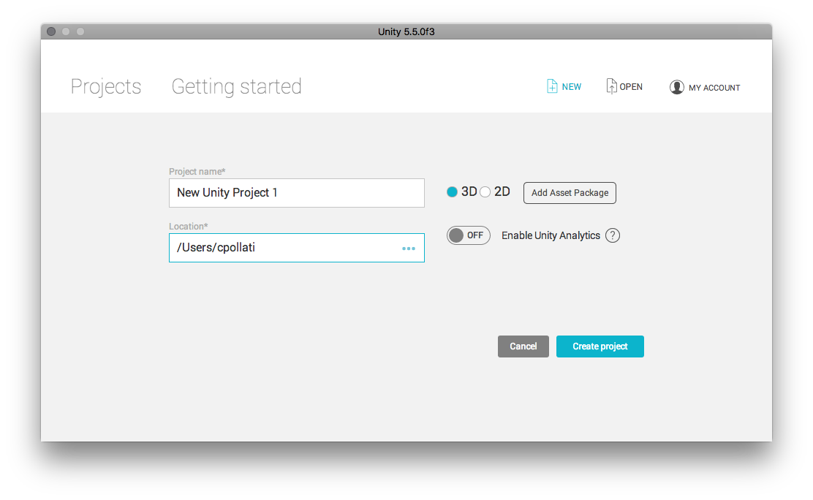
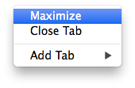
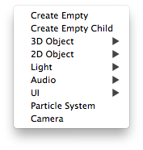
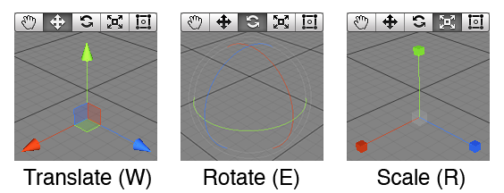
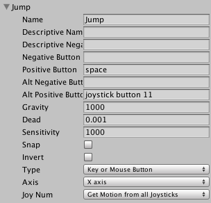
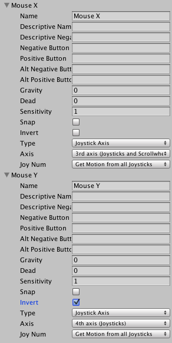
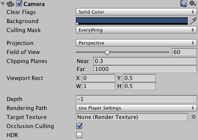
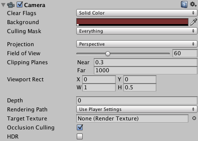
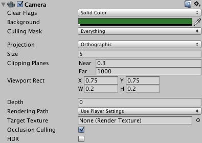
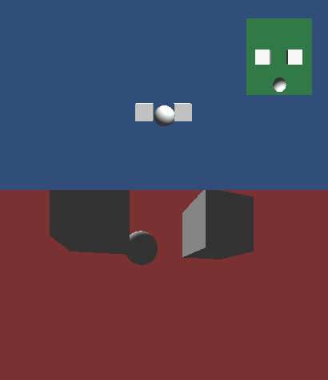

# Crash Course in Unity

Here is the introduction to Unity. In this part, we will go over the basics of the Unity interface

Before we do, let's first understand how we translate 3D coordinates on a 2D display.

## Pre-gaming

### 3D Basics - Left handed coordinates

When working with computers, knowing your coordinate system is important. Unity uses the Left Handed Coordinates system. This illustration show how to remember how the values go.


(image from http://flylib.com/books/en/2.416.1.16/1/)

This means all positive values are up, away from and to your right.
 
To rememer the colors of the coordinates, remeber how colors are represented in RGB on computers. This is how Unity handles marking the axis by default: <span style="color:red;">X is red</span>, <span style="color:green;">Y is green</span>, <span style="color:blue;">Z is blue</span>. The *Scene Gizmo* (pictured below) and all the handles when tranlating assets uses this color scheme too.

### Create a Unity Account
In order to use Unity, you should sign up for a free Unity Account. This account will give you access to the Unity Asset Store, as well as other services offered with Unity.

## The Project Dialog
Unity starts up with the Project Wizard (unless you already started a project and you have *Load Previous Project on Startup* checked off in **Unity -> Preferences**)

If you have opened any existing projects, Unity will list them on the *Project Dialog* screen.



It is best practice not to include  any of the packages (unless you really need them). You can always add them later to the project by going in the menu and selecting **Assets -> Import Package**.

For this class, you won't need to enable Unity Analytics. Unity Anayltics is a way to keep track of some player behaviors, like how many people are playing, how long they play, etc. 

##Interface

When you get to the main Unity window, you will notice a lot of things. But, remember that Unity's interface is designed to be customized.

Don't be afraid to do so! If you mess up and want to get back to the original layou, select from the menu **Window -> Layouts -> Revert Factory Settings...**.

If you really like a layout, you can select **Window -> Layouts -> Save Layout...**.

You can click and drag tabs around to rearrange the layout to your liking.

You can add tabs, remove them or maximize them by right clicking on a tab:



or by clicking on the little "drop menu marker"  

### Hierarchy


This shows items that are in your game world. When you create a new Scene (or you create a new Project which also creates a new Scene), Unity adds in by default, a Main Camera and a Directional Light. With Unity 5.3, they added support to edit multiple scenes, so now each scene can be listed as a group.

In this tab, you can also search for assets using the little filter box next to the *Create* drop down button:

You can create some Game Object by using the "Create" dropdown: 



All the objects you create will appear in the tab.

Double click on an asset in the view will bring that object to the focus of the last Scene tab you were working in.

A useful item is **Create Empty**, this can be used to group item, or to identify points in the 3D/2D word

You can also "nest" objects in this view by dragging them onto another asset.

### Scene
This is what is in the world of your game. There are also several options in a tool bar in this tab:
	
For more details about these options see: <http://docs.unity3d.com/Manual/SceneView.html>

#### Navigation
To navigate the scene there are several options:

* **Arrow Keys** - Use the arrow keys to move through the scene. Left and right pan, up and down move the camera in or out. Shift makes it move faster 

* **Right Mouse** (known as *Flythrough Mode*) - By clicking and holding the right mouse button you enter *Flythough Mode*. Use the WASD to move though the scene and the Q and E move up and down. Holding down shift make you move faster.

* **Alt Left Click Drag** - Orbits the camera around the current pivot point.

* **Alt Middle Click Drag** - You can zoom in and out of a view by using the mouse wheel. If you hold down the Alt key, it will zoom in/out based on the location of the mouse.

* **Alt Right Click Drag** *or* **Mouse Wheel** - You can zoom in and out of a view by using the mouse wheel. If you hold down the Alt key while using the mouse wheel, it will zoom in/out based on the location of the mouse.

* **F key** - If you select a GameObject, just type "F" to focus on that GameObject

#### Scene View Control Bar


This is there to help you control how things appear in the Scene. From here you can change how objects are rendered, 2D/3D view, change lighting, audio and more.

For more details about navigating see: <http://docs.unity3d.com/Manual/SceneViewNavigation.html>

#### Scene Gizmo
The scene also has the "Scene Gizmo"


You can click on the "arms" to snaps the Scene's view to that direction. 
	
### Game
When clicking on the "Play" button, this will let you run your game:
	

	
You must remember, when running the game, changes you make will be reverted when you stop the game. Also, you will not be able to import any packages during this time.
	
You may want to go into the menu, **Unity -> Preferences** and select Colors. There you can change the "Playmode Tint" to a bright color to make it more noticeable that you are in playmode.


	
### Project
Here is an important view. Everything that is created for your project like scripts, files, textures, etc. will appear here. These files will be in your actual project folder on your computer. It is important that you rearrange and move files around using the Project tab, doing so in Explorer (on Windows or Finder on a Mac) can lead to problems.
	
You can click the "Create" drop down, or right click inside the Project tab to create new folders, Scripts, as well as Import Packages.

As a developer, you should start to use standard conventions for setting up your projects. For the first projects in class, I won't be as strict, but after that every type of file that you add in your project should be in a separate folder, all scenes should be in a folder named "Scenes", all scripts, should be in a folder named "Scripts", etc.

If you have a Unity account (which is free and you need to make one to install Unity). You can click on **Favorites -> All Models** and then click on the "Asset Store:" bubble to search the Unity Asset store for pre-made models. Here you can select models that are free or you have to pay for. You can also do this for Materials, Prefabs and Scripts:
	

	
You can click and drag assets from the Project tab into your Scene. If you want to apply a material or a script to an asset, you just click and drag the material from the Project tab to the asset in the Scene.
	
### Console
This is where output from your game will appear. Get used to using this, as a programmer, this will become an important view to look through. 


This give you several options, and 3 filtering modes

* **Clear** - Clears the current console listing
* **Collapse** - This will make all repeating messages appear in a collapsed accordion, instead of on separate lines
* **Clear on Play** - Whenever you start playing the game, it will clear the current console window
* **Error Pause** - Whenever an error occurs, this will automatically pause the game.

* **Info Filter** - Toggle off or on to hide/show information messages from your game. This will be items displayed by the ```Debug.Log()``` that we will be using
* **Warning Filter** - Toggle off/on to hide/show anytime Unity throws a warning.
* **Error Filter** - Toggle off/on to hide/show any errors that Unity may throw  

	
### Inspector
This is where all the magic happens! This will tell you all about what's going on. If you click on an asset, it will give you the details about it. If you click on a script, it will give you a preview of the code. Click on a material, you can edit the material. This is where a lot of you work will happen. The inspector also allows you to add/remove components to an asset, as well as key in position, rotation, scale and other attributes of the asset. You can also change the "Tag" of an item or what "Layer" it is assigned to (more about this next class).

## Game Objects

The basic building block of things in Unity is a things called a GameObject. 

A Mesh is just the data for the shape of an object. A Model contains a Mesh but may also contain other data like textures, materials, shaders, etc.

Materials often are comprised of Textures and Shaders.


## Transforming

Changing the position of the game objects can be done by using the tools or by changing the values in the Inspector view.


(image from Unity manual)

**NOTE**: Remember, you can scale an object to a negative value, which will look the same as the positive equivalent, however, when you start scripting it may end up having adverse affects!

## Material

Creating materials for assets is just a right click **Create -> Materials** in the Project tab away! 

For most of the class you won't have to get too detailed. You will most likely just need to change the Albedo setting to change colors to help differentiate things like enemies and goal points. 

To change the material on an asset, just drag it from the Project tab onto the asset you want. You can drag it onto an asset in the Scene or Hierarchy.

## Terrain

To make terrain you can either click **Create -> 3D Object -> Terrain** from the Hierarchy Tab, or from the main menu select **Game Object -> 3D Object -> Terrain**.

In order to make terrain pretty and quickly, just import the package (From the main menu **Assets -> Import Package -> Environments**, or right click in the Project tab **Import Package -> Environments**). From the list, you can select to only add those in *Standard Assets -> Environments -> SpeedTree* and *Standard Assets -> Environments -> TerrainAssets* This will give you some basic ground textures, grass and trees.


*	**Raise/Lower Terrain** - Allows you to change the level of the terrain
	
*	**Paint Height** - The more you paint the higher the terrain becomes.
	
*	**Smooth Height** - Smooths out the heights
	
*	**Paint Texture** - Once you add terrain textures using the *Edit Textures...* button, you can select a texture and paint it. The first texture you add, becomes the default for all the terrain.
	
*	**Place Trees** - Once you add trees using the *Edit Trees...* button, you can gets trees to be placed on your terrain.
	
*	**Place Details** - Once you add grass using the *Edit Details...* button, you can paint on grass to the terrain. The grass works on a level of detail. If you are zoomed out from the terrain, these details may get culled from rendering and not appear. Also, remember the thicker the grass (based on Brush Size and Target Strength) the more processing power that is needed.
	
*	**Terrain Settings** - Here you can tweak the setting of the terrain. You import or export the height map so that it can be edited in Photoshop

## Skybox

If you want a sky in your game, they are real easy to setup. You have to add the skybox to whatever camera you will be using. Select the camera you want to use, and from the main menu **Component -> Rendering -> Skybox** or in the Inspector tab, you can click on *Add Component* button and then select **Rendering -> Skybox**. 


Then in the Inspector view, click on the little target button (looks like a circle with a dot) by None (Material). Now you can select whichtype of skybox texture you want. Or if you are daring, create your own textures!

## Fog

Unity 4 made it really easy to add fog, however in Unity 5, the option for it is hiden a little bit. Go in the menu and select **Windows -> Lighting**.  Open the window more, or scroll towards the bottom. Then you can check Fog and adjust the setting to your taste.

## Water

Want to add a body of water? Then you import the package from the main menu **Assets -> Import Package -> Environments**, or right click in the Project tab **Import Package -> Environments**. Then from the Project tab, go into *Assets -> Standard Assets -> Environment -> Water (Basic) -> Prefabs * or *Water -> Water -. Prefabs* , and you can drag either a daytime body of water or a night time version into your scene and you have rippling water.

## Character Controller

Well, if we have terrain and some water, why not add the ability to walk around our world! Unity has that covered too. **Assets -> Import Package -> Characters **, or right click in the Project tab **Import Package -> Characters**. 

Once imported, you can drag and drop from the Project tab's **Assets -> Standard Assets -> Characters -> FirstPersonCharacter -> Prefabs -> FPSController** either a 3rd Person or First Person controller. Sometimes the 3rd person controller's camera is a little wonky, so for now, we will stick to first person.

Make sure you place the character over the terrain since the player will have gravity. If not, the character will be falling endlessly.

You can then use WASD to move the player around, use the mouse to look around, and the space bar to jump around.

And if you don't see your skybox, remember, you have to have one attached to the camera. When you have a character controller, the camera 

If you want to use a joystick, Unity 5 has support for that. Earlier version of Unity 5.x did not have input setup for joysticks controlling the 1st person controller.

## Project Setting - Input
Here's were you can get to set up controls for you game. 

Unity can get input from an "axis" in scripting you can call ```Input.GetAxis("YourAxisNameHere")```. You can also assign an axis multiple input vales, or multiple axes with the same name.

For the game, we also want to be able to jump with the controller. To open up the Input settings, go in the menu and select **Edit -> Project Settings -> Input**. So, scroll down to the jump entry and open it up. Add "*joystick button 11*" to the *Alt Positive Button* field. **Note**: different systems, might have different button numbering for the same type of controller. Button 11 on my Mac, an XBox 360 controller is clicking the left thumbstick. On PC it should be 9 and Linux it's 10. See <http://wiki.unity3d.com/index.php?title=Xbox360Controller> for more information.



For looking around, we can hook up a new "Mouse X" and "Mouse Y" to look at our controller's second joystick. Add two new entries, name one "Mouse X" and the other "Mouse Y", change Gravity and Dead to 0 and Sensitivity to 1. For the Type select Joystick Axis. Then for Mouse X, select 3rd axis (Joystick and Scrollwheel) and Mouse Y select 4th axis (Joysticks)



When you run your project, you should be able to move around, with one thumbstick and look around with the other. 

## Lights

Unity can do a mix of realtime or precomputed lighting called "global illumination" or GI. Realtime lighting is updated with every frame and can be changed though out the lifecycle of the game.

Lights are components, they can be added to existing objects or should be added to "Empty" game object.

There are 4 types of realtime lights:

*	**Directional Light** - Like the sun.

*	**Point Light** - Is like a lightbulb, emits light in all directions
	
*	**Spot Light** -  Is like a flashlight. You can also add a Cookie to the spotlight. A cookie is a black and white texture that will be projected from the spotlight.

*	**Area Light** - Is a light where light is emitted in all directions from one side.

For Baked GI or Precomputed Realtime GI (which we won't focus on, or maybe later in the semester) there are a couple of things that show up in the **Create -> Lights** menu: 

*	**Reflection Probes** - For use with Baked GI or Precomputed Realtime GI, these are points that will help to create reflections
	
*	**Light Probe Group** - Helps store information for lighting 	
## Camera

Unity can have as many cameras as you want. You can also change the viewport to change how that camera is displayed. For instance doing a split screen, you would have one camera set up like this:



changing the Viewport Rectangle to Y = 0.5, and H = 0.5. and a second camera setup like this:



Changing H = 0.5. I also changed the background to a red color. I also added a depth of 0 to make sure that it appears in front of the first camera (which has a depth of -1).

Notice that the X, Y, H, and W are all expressed as 0 to 1. The value 0 starts at the lower-left and 1 is the top-right.

You can also add a map of the world by placing a camera looking down on the level. You can also display that on top of a split screen with setting like this:



With these 3 cameras set up you will get a display like this:



## Layers 

By default there are 8 layers, however, you can define up to 24 of your own. To define your own, select from the menu **Edit -> Project Settings -> Tags and Layers**. They are use to define how Unity renders a scene.

Layers are a good way of organizing items which you can hide or show whenever you need in the scene view. You can also use layers to prevent objects from being illuminated by light or being rendered by a camera. 

## Sorting Layers

These are used in conjuction with sprite graphics in 2D projects. We will talk about these later in the semester.

## Tags 

A tag is a word that you use to link one or more game objects together. You can add as many as you like. They can be used in code to help you find an item of this type. Again to define your own, select from the menu **Edit -> Project Settings -> Tags and Layers** and start entering a tag name in the empty "element" field. As you as tags, a new blank element will appear.

## Rigidbodies

To use Unity's physics engine, you need to add Rigidbodies to a game object. This can be done by either clicking on Add Component and selecting Physics and then Rigidbody, or from the menu under **Component -> Physics -> Rigidbody**.

You can turn on or off gravity with the "Use Gravity" option.

You can also constrain the object, meaning that you can lock the item to only moving along a particular axis or only being able to rotate on a particular axis.

Collision Detections is set to Discrete by default. However, if you have fast moving objects, you may need to change that to Continuous which will impact performance. Continuous Dynamic will use the "continuous" method of checking on other "continuous" objects, and "discrete" detection on other "discrete" objects.

## Collider

By default, when creating objects like Cubes, Spheres, Planes, etc, there is a collider attached to it. These will allow for collision detection to take place. If you happen to uncheck a Collider, a Ridigbody will not be able to detect that object.

You can also change the size and position of the collider. 

The option "Is Trigger" will be important when we get to scripting! 

## Physics Material

You can change the kind of material that the object is by creating a new material by right clicking the Assets folder and selecting **Create -> Physics Material**. Here you can make an object more "bouncy" or have more or less friction.

